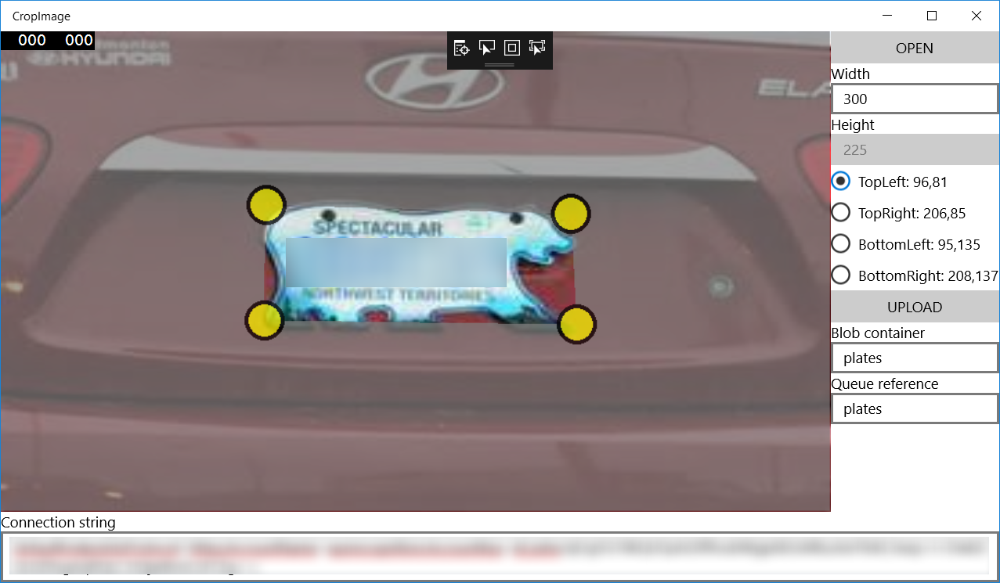

# CropImage
UWP UI to crop image and send as a blob and message to Azure Storage 

1. push OPEN button to open image from a local storage
2. setup target width of image (height will be calculated)
3. mark all corners on the picture
4. paste connection string to Azure Storage
5. fill blob container
6. fill queue reference
7. push UPLOAD button to
	- upload image to Azure blob storage with a name [yyyy-MM-dd-HH-mm-ss-fff].jpg
	- upload a JSON (path to image and set of four points) to Azure queue storage

